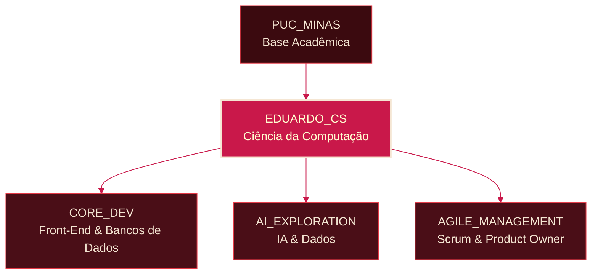

<!--
  =========================================================
  README.md - Perfil do GitHub
  Tema: "Lírio Aranha Vermelho" (Higanbana) - Vinho Profundo / Carmim / Creme
  Dono: Eduardo Borges de Souza (@EduardoBO4)
  =========================================================
  COMO USAR ESTE ARQUIVO:
  1. Crie um repositório público com o MESMO nome do seu usuário
     do GitHub (ex: "EduardoBO4/EduardoBO4").
  2. Coloque este arquivo dentro dele como README.md.
  3. Procure pelos comentários "TODO" abaixo e substitua cada
     placeholder pelos seus próprios links, imagens e textos.
  =========================================================
-->

<!-- TODO: PERSONALIZE O TEXTO E AS CORES DO BANNER SE QUISER -->
<!-- Este banner é gerado pelo serviço capsule-render, então ele
     sempre carrega (não depende de imagem externa quebrável).
     Você pode trocar o texto, as cores (hex sem "#") e o tipo
     (waving, rect, cylinder, etc). Documentação:
     https://github.com/kyechan99/capsule-render -->

<!-- Cabeçalho animado (typing). TODO: edite o texto de "lines" se quiser outra mensagem -->

 

<!--
  =========================================================
  SEÇÃO 1 - SOBRE MIM
  =========================================================
-->

## Sobre Mim

Sou estudante de Ciência da Computação e gosto de transformar ideias em software funcional.
Meu foco principal é o **Desenvolvimento Front-End**, com interesses crescentes em
**Inteligência Artificial**, **Bancos de Dados** e **Gestão Ágil** (práticas de
Product Owner e Scrum Master).

- Estudando **Ciência da Computação** na **PUC Minas** (atualmente 1,5 de 4 anos)
- Interesse em construir sistemas completos e bem estruturados, do banco de dados
  até a interface do usuário
- Explorando **IA** e soluções orientadas a dados
- Aprendendo frameworks **Ágeis** e como liderar equipes técnicas como futuro
  **Product Owner / Scrum Master**
<!-- TODO: ADICIONE OU EDITE SEUS PRÓPRIOS TÓPICOS ACIMA -->

### Meu Caminho: Diagrama Conceitual

<!-- Este diagrama funciona como as raízes do Lírio Aranha Vermelho:
     cada área de estudo alimenta a mesma flor central (eu). -->

<!-- TODO: ADICIONE MAIS NÓS/RAMOS SE VOCÊ GANHAR NOVOS INTERESSES -->

 

<!--
  =========================================================
  SEÇÃO 2 - HABILIDADES E TECNOLOGIAS
  =========================================================
  Paleta das badges:
    labelColor (lado esquerdo) = 3B0A0F (vinho profundo)
    color (lado direito)       = C9184A (carmim)
    logoColor (ícone/texto)    = F5E6D3 (creme)
-->

## Habilidades e Tecnologias

### Ferramentas de Produto e Metodologias Ágeis

<!-- TODO: REMOVA QUALQUER BADGE DE FERRAMENTA QUE VOCÊ NÃO USE, OU ADICIONE NOVAS -->

-3B0A0F?style=for-the-badge&logo=trello&logoColor=F5E6D3&labelColor=3B0A0F)
-3B0A0F?style=for-the-badge&logo=miro&logoColor=F5E6D3&labelColor=3B0A0F)

### Desenvolvimento Back-end

<!-- TODO: AJUSTE PARA A SUA STACK REAL -->

### Desenvolvimento Front-end

<!-- TODO: AJUSTE PARA A SUA STACK REAL -->

### Inteligência Artificial e Dados

<!-- TODO: AJUSTE PARA A SUA STACK REAL -->

### Bancos de Dados e DevOps

<!-- TODO: AJUSTE PARA A SUA STACK REAL -->

 

<!--
  =========================================================
  SEÇÃO 3 - ESTATÍSTICAS DO GITHUB (O "SOLO" DA PLANTA)
  =========================================================
  Metáfora: o gráfico de contribuições abaixo é o solo nutrido.
  As raízes do Lírio Aranha Vermelho alcançam esse solo todos os
  dias, absorvendo energia (commits, sequências, atividade) para
  manter a flor no topo da página florescendo.
-->

## Estatísticas do GitHub

<!-- Trocado de "github-readme-stats.vercel.app" para "github-stats-extended.vercel.app":
     é o sucessor oficial do mesmo projeto, mantido ativamente e com
     instância pública mais estável (menos sobrecarga/erro). A sintaxe
     dos parâmetros é idêntica, só o domínio muda. -->
<!-- TODO: TROQUE "EduardoBO4" ABAIXO CASO SEU USUÁRIO DO GITHUB MUDE -->

<!-- Sequência de contribuições: representa a constância com que as raízes
     absorveram "nutrientes" (contribuições diárias) -->
<!-- TODO: TROQUE "EduardoBO4" ABAIXO CASO SEU USUÁRIO DO GITHUB MUDE -->

<!-- Card de linguagens mais usadas, mesma paleta, mesmo domínio mais estável -->
<!-- TODO: TROQUE "EduardoBO4" ABAIXO CASO SEU USUÁRIO DO GITHUB MUDE -->

<!-- Linha divisória gerada pelo capsule-render (sempre carrega) -->

 

<!--
  =========================================================
  SEÇÃO 4 - CONECTE-SE COMIGO
  =========================================================
-->

## Conecte-se Comigo

 

Obrigado por visitar meu perfil.

