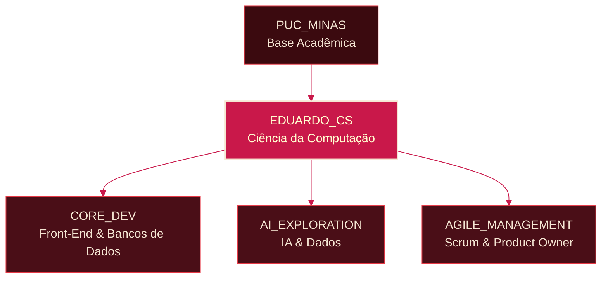
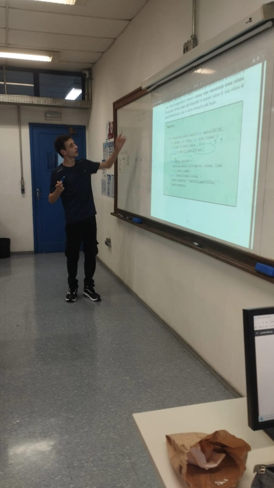
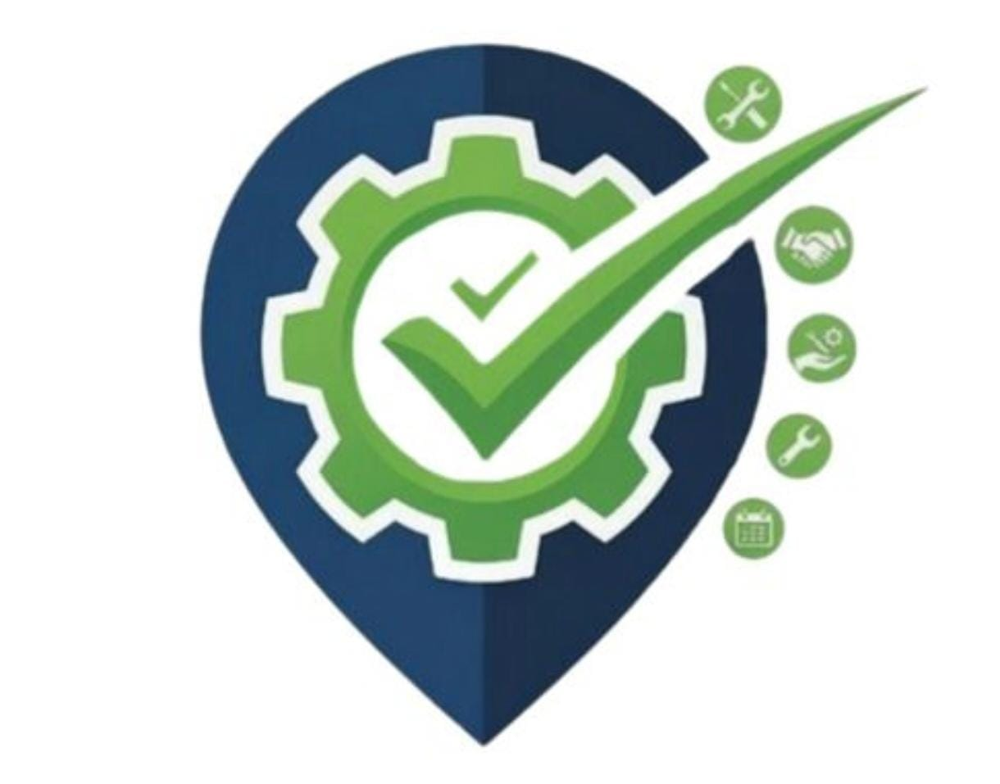

<!--
  =========================================================
  README.md - Perfil do GitHub
  Tema: "Lírio Aranha Vermelho" (Higanbana) - Vinho Profundo / Carmim / Creme
  Dono: Eduardo Borges de Souza (@EduardoBO4)
  =========================================================
  COMO USAR ESTE ARQUIVO:
  1. Crie um repositório público com o MESMO nome do seu usuário
     do GitHub (ex: "EduardoBO4/EduardoBO4").
  2. Coloque este arquivo dentro dele como README.md.
  3. Procure pelos comentários "TODO" abaixo e substitua cada
     placeholder pelos seus próprios links, imagens e textos.
  =========================================================
-->

<!-- TODO: PERSONALIZE O TEXTO E AS CORES DO BANNER SE QUISER -->
<!-- Este banner é gerado pelo serviço capsule-render, então ele
     sempre carrega (não depende de imagem externa quebrável).
     Você pode trocar o texto, as cores (hex sem "#") e o tipo
     (waving, rect, cylinder, etc). Documentação:
     https://github.com/kyechan99/capsule-render -->

<!-- Cabeçalho animado (typing). TODO: edite o texto de "lines" se quiser outra mensagem -->

 

<!--
  =========================================================
  SEÇÃO 1 - SOBRE MIM
  =========================================================
-->

## Sobre Mim

Sou estudante de Ciência da Computação e gosto de transformar ideias em software funcional.
Meu foco principal é o **Desenvolvimento Front-End**, com interesses crescentes em
**Inteligência Artificial** e **Bancos de Dados**. Também estou estudando por conta
própria os fundamentos de **Metodologias Ágeis**, de olho em uma futura atuação como
Product Owner ou Scrum Master.

- Estudando **Ciência da Computação** na **PUC Minas** (atualmente 1,5 de 4 anos)
- Focado em **Front-End**, com interesse crescente em entender o sistema completo,
  do banco de dados até a interface do usuário
- Explorando **IA** e soluções orientadas a dados
- Estudando os fundamentos de **Scrum** e **Product Owner** por conta própria
<!-- TODO: ADICIONE OU EDITE SEUS PRÓPRIOS TÓPICOS ACIMA -->

### Meu Caminho: Diagrama Conceitual

<!-- Este diagrama funciona como as raízes do Lírio Aranha Vermelho:
     cada área de estudo alimenta a mesma flor central (eu). -->

<!-- TODO: ADICIONE MAIS NÓS/RAMOS SE VOCÊ GANHAR NOVOS INTERESSES -->

 

<!--
  =========================================================
  SEÇÃO 2 - PROJETOS E EXPERIÊNCIAS
  =========================================================
  Cada card = uma foto + uma descrição curta e pessoal + tags.
  As tags substituem os badges de "Habilidades e Tecnologias"
  que existiam antes: em vez de listar tecnologia solta, elas
  aparecem coladas no projeto/experiência onde você usou aquilo
  de verdade — o que é bem mais forte pra quem for ler.

  O GitHub remove estilo CSS customizado de HTML solto no README,
  então não dá pra pintar o fundo do card na cor do perfil
  diretamente. Por isso as tags (que são imagens geradas pelo
  shields.io) carregam a paleta vinho/carmim/creme — é o jeito
  que garante que a cor aparece de verdade.

  COMO ADICIONAR UM NOVO CARD:
  Copie um bloco <table>...</table> inteiro (de um TODO a outro)
  e cole logo abaixo, ajustando foto, título, descrição e tags.
-->

## Projetos e Experiências

<!-- TODO: CARD 1 — exemplo de experiência (monitoria). Ajuste ou apague. -->
<table>
<tr>
<td width="160" valign="top">

</td>
<td valign="top">

**Monitoria de Algoritmos e Estrutura de Dados**

<!-- TODO: ajuste a descrição pro seu jeito de contar essa experiência -->
Ajudei colegas de turma a destravar em Algoritmos e Estrutura de Dados,
tirando dúvida, revendo exercício e tentando deixar a matéria menos
assustadora do que ela parece no começo. Foi ali que percebi que gosto
tanto de resolver problema quanto de explicar como cheguei na solução.

</td>
</tr>
</table>

 

<!-- TODO: CARD 2 — modelo em branco pra você preencher com um projeto real -->
<table>
<tr>
<td width="160" valign="top">

</td>
<td valign="top">

**Nome do Projeto**

<!-- TODO: descreva o que o projeto faz e por que você o construiu, num tom seu -->
Descreva aqui o que é o projeto, o problema que ele resolve e o que você
aprendeu construindo.

<!-- TODO: troque as tags abaixo pelas tecnologias/habilidades reais do projeto -->

</td>
</tr>
</table>

<!--
  =========================================================
  BANCO DE TAGS (antigos badges de "Habilidades e Tecnologias")
  =========================================================
  Guardado aqui só como referência: copie a linha da tecnologia
  que quiser usar num card acima e cole dentro da célula certa.
  Nada aqui aparece no perfil até você mover pra um card.

-3B0A0F?style=for-the-badge&logo=trello&logoColor=F5E6D3&labelColor=3B0A0F)

-->

 

<!-- Linha divisória gerada pelo capsule-render (sempre carrega) -->

 

<!--
  =========================================================
  SEÇÃO 4 - CONECTE-SE COMIGO
  =========================================================
-->

## Conecte-se Comigo

 

Obrigado por visitar meu perfil.

