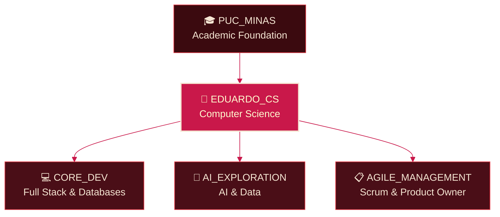

<!--
  =========================================================
  README.md — GitHub Profile
  Theme: "Red Spider Lily" (Higanbana) — Deep Wine / Crimson / Cream
  Owner: Eduardo Borges de Souza (@EduardoBO4)
  =========================================================
  HOW TO USE THIS FILE:
  1. Create a public repository with the EXACT same name as your
     GitHub username (e.g. "EduardoBO4/EduardoBO4").
  2. Put this file inside it as README.md.
  3. Search for "TODO" comments below and replace every
     placeholder with your own links, images and text.
  =========================================================
-->

<!-- TODO: REPLACE WITH YOUR OWN BANNER IMAGE -->
<!-- Suggestion: a wide (1200x300) illustration of a Red Spider Lily
     blooming, using the palette below. You can generate one and
     upload it to your repo (e.g. /assets/banner.png), or use an
     external image host. -->

<!-- Animated typing header. TODO: edit the "lines" text if you want a different message -->

<!-- TODO: REPLACE WITH YOUR OWN NAME IF DIFFERENT -->
# Hi, I'm Eduardo Borges 🌺

**Computer Science Student | Full Stack & AI Explorer | Agile Enthusiast**

<!-- TODO: REPLACE WITH A ROOT/DIVIDER IMAGE IF YOU HAVE ONE -->
<!-- This thin image represents the "roots" of the lily connecting each section -->

 

<!--
  =========================================================
  SECTION 1 — ABOUT ME
  =========================================================
-->

## 🌱 About Me

I'm a Computer Science student who enjoys turning ideas into working software.
My focus is on **Full Stack Development**, with growing interests in
**Artificial Intelligence**, **Databases**, and **Agile Management**
(Product Owner & Scrum Master practices).

- 🎓 Studying **Computer Science** at **PUC Minas** (currently 1.5 of 4 years)
- 💻 Interested in building complete, well-structured systems — from the
  database up to the user interface
- 🤖 Exploring **AI** and data-driven solutions
- 📋 Learning **Agile** frameworks and how to lead technical teams as a
  future **Product Owner / Scrum Master**
<!-- TODO: ADD OR EDIT YOUR OWN BULLET POINTS ABOVE -->

### 🗺️ My Path — Conceptual Diagram

<!-- This diagram works like the roots of the Red Spider Lily:
     every branch of study feeds the same central flower (me). -->

<!-- TODO: ADD MORE NODES/BRANCHES IF YOU PICK UP NEW INTERESTS -->

 

<!--
  =========================================================
  SECTION 2 — SKILLS & TECHNOLOGIES
  =========================================================
  Badge palette:
    labelColor (left side)  = 3B0A0F (deep wine)
    color (right side)      = C9184A (crimson)
    logoColor (icon/text)   = F5E6D3 (cream)
-->

## 🛠️ Languages & Technologies

### 📋 Product & Agile Tools

<!-- TODO: REMOVE ANY BADGE FOR A TOOL YOU DON'T USE, OR ADD NEW ONES -->

### ⚙️ Back-end Development

<!-- TODO: ADJUST TO YOUR REAL STACK -->

### 🎨 Front-end Development

<!-- TODO: ADJUST TO YOUR REAL STACK -->

### 🤖 Artificial Intelligence & Data

<!-- TODO: ADJUST TO YOUR REAL STACK -->

### 🗄️ Databases & DevOps

<!-- TODO: ADJUST TO YOUR REAL STACK -->

 

<!--
  =========================================================
  SECTION 3 — GITHUB STATS ("SOIL" OF THE PLANT)
  =========================================================
  Metaphor: the contribution graph below is the nourished soil.
  The roots of the Red Spider Lily reach into this soil every day,
  absorbing energy (commits, streaks, activity) to keep the
  flower at the top of the page blooming.
-->

## 🌾 GitHub Stats — Soil of the Plant

<!-- TODO: REPLACE "EduardoBO4" BELOW WITH YOUR GITHUB USERNAME IF IT CHANGES -->

<!-- Streak stats: represents how consistently the roots have been
     absorbing "nutrients" (daily contributions) -->
<!-- TODO: REPLACE "EduardoBO4" BELOW WITH YOUR GITHUB USERNAME IF IT CHANGES -->

<!-- Most used languages card, same palette -->
<!-- TODO: REPLACE "EduardoBO4" BELOW WITH YOUR GITHUB USERNAME IF IT CHANGES -->

<!-- TODO: REPLACE WITH YOUR OWN ROOT/DIVIDER IMAGE IF YOU HAVE ONE -->

 

<!--
  =========================================================
  SECTION 4 — CONNECT WITH ME
  =========================================================
-->

## 🌸 Connect With Me

<!-- TODO: REPLACE THE URL BELOW WITH YOUR REAL LINKEDIN PROFILE LINK -->

<!-- TODO: REPLACE WITH YOUR REAL EMAIL ADDRESS -->

<!-- TODO: REPLACE THE URL BELOW WITH YOUR REAL INSTAGRAM PROFILE LINK -->

<!-- TODO: REPLACE THE URL BELOW WITH YOUR REAL X (TWITTER) PROFILE LINK -->

 

<!-- TODO: REPLACE WITH YOUR OWN CLOSING BANNER/IMAGE IF YOU WANT ONE -->
🌺 Thanks for visiting my profile — like the Red Spider Lily, always growing. 🌺

